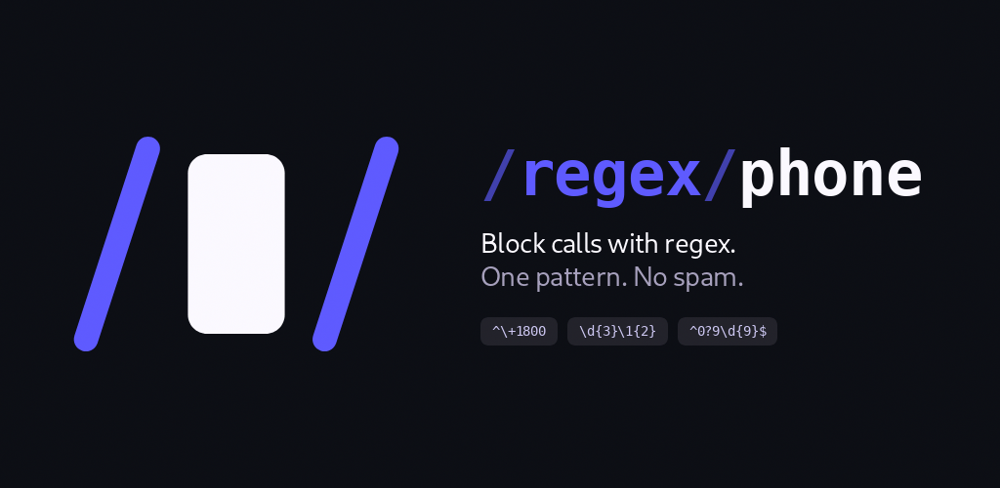
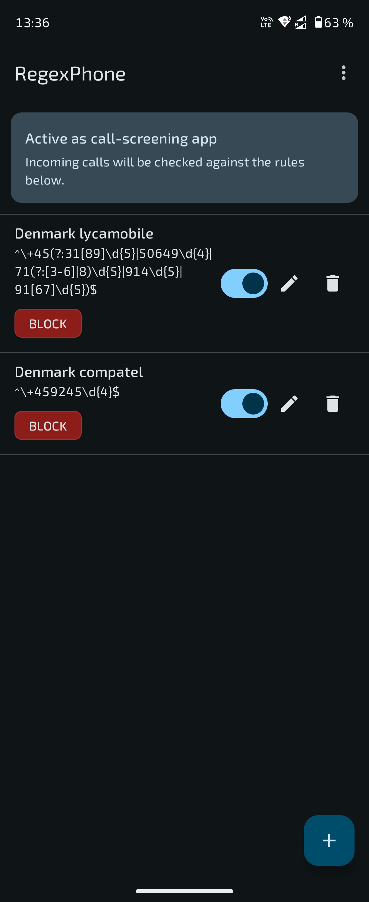
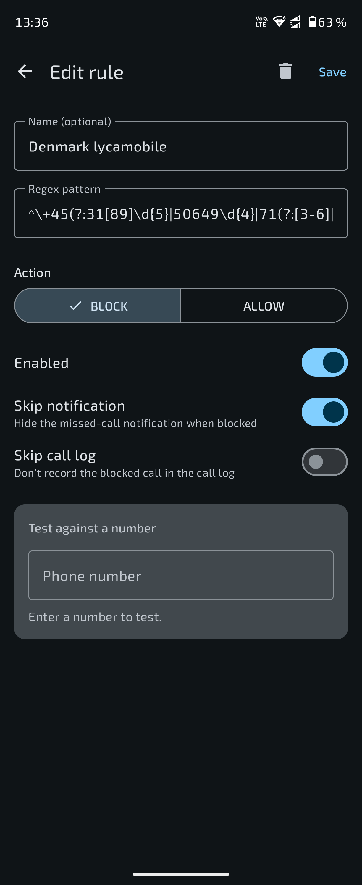

<p align="center">
  
</p>

<h1 align="center">RegexPhone</h1>

<p align="center">
  Block or allow incoming calls with regular expressions.<br/>
  Native Android <code>CallScreeningService</code>, no background daemons, no contacts permission, no network.
</p>

<p align="center">
  
  
  
  
  
  
</p>

---

## What it does

For every incoming call, RegexPhone matches the caller's phone number against your rules and either lets it ring, rejects it, or silences the ringtone. Each rule is a regular expression with an action (`BLOCK`, `SILENCE`, or `ALLOW`) and, for block rules, control over whether the missed-call notification should appear.

## Highlights

- **Three actions per rule.** `BLOCK` rejects the call; `SILENCE` mutes the ringtone but lets the call still hit the call log and notification shade; `ALLOW` whitelists.
- **Per-block flag.** Skip the missed-call notification, per rule. Android itself always records blocked calls in the call log; only carrier and system screeners may suppress that, so RegexPhone does not pretend to offer it.
- **Predictable precedence.** Allow beats block beats silence; otherwise the call is allowed. Order of rules within each action is irrelevant.
- **Live tester.** The edit screen previews, as you type, the decision the service would take for a sample number across all enabled rules, naming the rule that decides.
- **Import / Export.** Save the full rule set to a JSON file via Storage Access Framework, restore it on another device, or merge two sets together. No permissions needed.
- **Simple storage.** Rules are JSON in `SharedPreferences`, kept in device-protected storage so screening already works between a reboot and the first unlock. Device-protected storage is encrypted with a device key rather than the lock-screen credential.
- **No background services, no contacts permission, no network access.**

## Screenshots

<p align="center">
  
  &nbsp;&nbsp;
  
</p>

<p align="center"><em>Left: rules list with role-status banner. Right: edit screen with the per-rule notification toggle.</em></p>

## How matching works

| Aspect | Behaviour |
| --- | --- |
| Source | `Call.Details.handle.schemeSpecificPart`, URI-decoded |
| Number forms | each rule is tried against the string as delivered by the carrier, its separator-stripped form, and its E.164 form (derived from the current network or SIM country); the rule matches if any form matches |
| Hidden / withheld numbers | match as the empty string; block them with `^$` |
| Match function | `Matcher.find()` (substring); anchor with `^` and `$` for whole-number match |
| Invalid regex | never matches; the editor refuses to save it |

For each incoming call:

1. If any enabled `ALLOW` rule matches, the call is allowed.
2. Else if any enabled `BLOCK` rule matches, the call is rejected. The **skip notification** flag of the *first* matching block rule applies.
3. Else if any enabled `SILENCE` rule matches, the call rings silently (no audible ringtone), but the call log and notifications are unaffected.
4. Otherwise the call is allowed.

## Example rules

> All numbers below use the NANP fictional ranges (`555` exchange in any area code, or area code `555`) so they cannot belong to any real subscriber.

| Pattern | Action | What it does |
| --- | --- | --- |
| `^\+12025550123$` | `BLOCK` | Block exactly one specific number. Substitute the real number from your call log. |
| `^\+44` | `BLOCK` | Block every call from a country (here `+44` is the UK). Works for any country code. |
| `^$` | `BLOCK` | Block withheld / hidden numbers — Android delivers an empty string in that case. |
| `^\+1555\d{7}$` | `BLOCK` | Block a whole carrier or number range. `\d{7}` matches the seven digits after the fixed `+1555` prefix. |
| `^\+32`<br/>`.*` | `ALLOW`<br/>`BLOCK` | Two rules together: whitelist a country (Belgium), reject everything else. `.*` matches any sequence including the empty string. |
| `^\+1` | `SILENCE` | Mute the ringtone for calls from a country. The call still hits the call log and notification shade. |

## Install

Grab the latest signed APK from the [Releases page](https://github.com/renaudallard/regexphone/releases/latest), then:

```sh
adb install -r regexphone-X.Y.Z.apk
```

On first launch tap **Set as default** in the status card and accept the system dialog; the card turns green once the role is granted.

## Build from source

| Tool | Version |
| --- | --- |
| JDK | 17 or 21 |
| Android SDK | Platform 35 and Build-tools 35.0.x |
| Gradle | 8.10.2 (via wrapper) |

```sh
git clone https://github.com/renaudallard/regexphone.git
cd regexphone

# One-time, only if gradle/wrapper/gradle-wrapper.jar is missing:
gradle wrapper --gradle-version 8.10.2

./gradlew testDebugUnitTest
./gradlew assembleDebug
```

The APK lands at `app/build/outputs/apk/debug/app-debug.apk`.

### Release builds

`./gradlew assembleRelease` produces `app/build/outputs/apk/release/app-release.apk`. The build script picks up signing credentials from Gradle properties (typically `~/.gradle/gradle.properties`):

```
REGEXPHONE_KEYSTORE_PATH=/absolute/path/to/keystore.jks
REGEXPHONE_KEYSTORE_PASSWORD=...
REGEXPHONE_KEY_ALIAS=regexphone
REGEXPHONE_KEY_PASSWORD=...
```

If `REGEXPHONE_KEYSTORE_PATH` is unset or points to a missing file, `assembleRelease` still works and emits `app-release-unsigned.apk`. Generate a fresh keystore with:

```sh
keytool -genkeypair -keystore ~/.keystores/regexphone-release.jks \
  -storetype PKCS12 -alias regexphone -keyalg RSA -keysize 2048 \
  -validity 36500 -dname "CN=Your Name, O=RegexPhone"
```

Keystore files (`*.jks`, `*.keystore`) are gitignored. Back the keystore up off-device; losing it means you can never sign a follow-up release with the same identity.

<details>
<summary>Debian arm64 setup (the official <code>google-android-*-installer</code> packages are amd64-only)</summary>

```sh
sudo apt install openjdk-21-jdk
curl -LO https://dl.google.com/android/repository/commandlinetools-linux-13114758_latest.zip
mkdir -p ~/Android/Sdk/cmdline-tools
unzip commandlinetools-linux-13114758_latest.zip -d ~/Android/Sdk/cmdline-tools
mv ~/Android/Sdk/cmdline-tools/cmdline-tools ~/Android/Sdk/cmdline-tools/latest

export JAVA_HOME=/usr/lib/jvm/java-21-openjdk-arm64
export PATH=~/Android/Sdk/cmdline-tools/latest/bin:$PATH

yes | sdkmanager --licenses
sdkmanager 'platforms;android-35' 'build-tools;35.0.1' 'platform-tools'

echo "sdk.dir=$HOME/Android/Sdk" > local.properties
```

Debian's `gradle` is 4.4.1, which is too old to bootstrap AGP 8. Either copy `gradle/wrapper/gradle-wrapper.jar` from a host that has it, or grab a standalone Gradle 8.10.2:

```sh
curl -LO https://services.gradle.org/distributions/gradle-8.10.2-bin.zip
unzip gradle-8.10.2-bin.zip -d ~/Android
~/Android/gradle-8.10.2/bin/gradle wrapper --gradle-version 8.10.2
```

</details>

## Project layout

```
app/src/main/java/it/allard/regexphone/
├── MainActivity.kt
├── data/
│   ├── Rule.kt                      data class + compiled-Pattern cache
│   ├── RuleIO.kt                    pure encode / decode / merge helpers
│   └── RuleRepository.kt            singleton, SharedPreferences-backed
├── service/
│   └── FilterCallScreeningService.kt    pure decide() + the Android binding
└── ui/
    ├── Theme.kt
    ├── RulesListScreen.kt           list + role-status card + FAB + menu
    └── EditRuleScreen.kt            form + live tester
```

Tests live under `app/src/test/java/it/allard/regexphone/`: `DecideTest.kt` exercises `FilterCallScreeningService.decide()`, `RuleIOTest.kt` covers JSON round-trip and merge-with-fresh-ids. Both run without Android stubs.

## Limitations

- Only incoming calls are screened. The platform also hands outgoing calls to the screening service (for caller-ID purposes) but ignores any screening response for them; RegexPhone answers those with a no-op without evaluating rules.
- Blocked calls always appear in the call log with the *blocked* type. The `CallScreeningService` API reserves call-log suppression for carrier and system apps.
- **Callers already in your contact list bypass the regex entirely.** Android's telecom layer short-circuits `CallScreeningService` when the incoming number matches a saved contact: it returns *allow* without ever invoking the screening service, so no rule of yours can run. To block a number that is in contacts, delete (or temporarily delete) the contact entry first. This is by design at the system level — the official `CallScreeningService` documentation states the service is "called when a new incoming or outgoing call is added which is not in the user's contact list."
- `java.util.regex.Pattern` has no built-in match timeout, and a regex with nested quantifiers like `(a+)+b` can backtrack catastrophically. RegexPhone runs every match on a watchdog thread with a 1 second deadline: a pattern that misses it is treated as *no match* and is skipped for the rest of the process lifetime, so the screening response always stays within Telecom's ~5 second budget. A runaway match cannot be cancelled mid-flight, so it may keep one core busy in the background until it finishes.

---

## Support this project

If you find RegexPhone useful, you can support development:

[](https://www.paypal.me/RenaudAllard)

## License

BSD 2-Clause "Simplified" License. Copyright (c) 2026, Renaud Allard <renaud@allard.it>. See [LICENSE](LICENSE) for the full text. Every Kotlin source file carries the same header.

## Branding

The icon set under `branding/` is generated from `branding/source/*.svg` and theme color `#5E5BFF`. The monochrome layer is wired up for Android 13+ themed icons.
